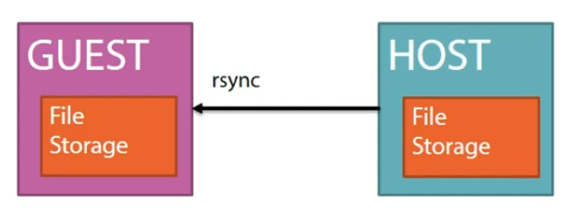

= Assignments

* By default Vagrant runs virtual machines headless. Modify the Vagrantfile to display the GUI (VirtualBox display) when booting the machine.
** Modify the Vagrant file
** `vagrant reload`

* Customize the amount of memory on the VM to 512 MB
** Modify the Vagrantfile
** `vagrant reload`
** Log in via the GUI (VirtualBox display)

* Vagrant provides a mechanism to share files between the host and the VM, called synced folder
** Create a file `hello.txt` on the **host** in ~/vagrant/debian11
** Add "Hello World" in the hello.txt file
** Modify the Vagrantfile to "sync" the directory containing the Vagrantfile to /vagrant on the VM 
*** `config.vm.synced_folder ".", "/vagrant", disabled: false`
** `vagrant reload`
** Display the contents of the file hello.txt on the VM with the `cat` command

* Explain in detail what the following commands do:
** `vagrant suspend`
** `vagrant status`
** `vagrant resume`

* The Vagrantfile contains details of the virtual environment/machines. Use the following code to create an empty file hello.txt in /tmp on the VM

    config.vm.provision "shell", inline: <<-SHELL
       touch /tmp/hello.txt
    SHELL

** Verify if the file is created
** Destroy the VM
** Create a new one and verify if the file is there
** Read logs ... 
*** Provisioning is done automatically during the first `vagrant up`, after the first `vagrant up` ... 
** Run `vagrant reload` and check it the file is still there, if not ... solve it. 

* Log in the VM via `vagrant ssh`
** Use the command `id` to identify your identity
*** You should be user *vagrant* on the VM
** Who is the owner of the file /tmp/hello.txt
*** This should be *root*
** So vagrant has the possibility to "become root" on the VM (and install software/files/ ...)

* Press `vagrant -h` and `vagrant -h --debug` on the host machine and read the messages

* The VM vagrant creates is called "debian11", change the hostname of the VM to webserver.

* Use the SHELL provisioner to:
** update all installed software to the latest version
** install the web server nginx
** start the nginx web server  

  config.vm.provision "shell", inline: <<-SHELL
     apt update -y
     apt upgrade -y
     apt install nginx -y
     service nginx status
   SHELL

* Forward (tcp-)port 80 on the guest VM to (tcp-)port 8080 on the host
** Modify the Vagrantfile accordingly
** Test if the port forward was succesfull

* Create a subdirectory in /vagrant on the guest, called www and copy the files from /var/www/html to /vagrant/www
** Remove the directory html in /var/www on the guest

  sudo rm -Rf /var/www/html

** Create a symbolic link (shortcut) from /vagrant/www to /var/www/html on the guest
   
  sudo ln -s /vagrant/www /var/www/html

** Surf to 127.0.0.1:8080 on the host, is the default nginx page displayed?
** Modify the index-file in the www directory (the synced folder to /vagrant/www on the guest). Verify the modifications by surfing to 127.0.0.1:8080 again.
*** An example of a modification is deleting everything in the file, except one word eg. NGINX.

* Put the two extra commands from the previous exercise to the provision script portion of the Vagrantfile
** Keep in mind the provisioning is run by elevated privileges, a.k.a. root privileges
** Verify if the provisioning script is working, by destroying the guest and recreate a new one

   vagrant destroy -f
   vagrant up

* Modify the Vagrantfile to "sync" the directory containing the Vagrantfile to /vagrant on the VM using the rsync method

* Create a file KROEPOEK1 in /vagrant on the guest, is it copied to the host?
* Create a file KROEPOEK2 in the directory containing the Vagrantfile, is it copied to the gust?
** The rsync synced folder does a one-time one-way sync from the host machine to the guest machine being started by Vagrant.

* Read the following https://www.vagrantup.com/docs/multi-machine[documentation on multi-machine in Vagrant]

** Explain the following statement from the documentation: ** Vagrant enforces ordering outside-in ** 
** Remove the guest VM with `vagrant destroy -f`
** Create a new Vagrant project on the host:

 cd ..
 mkdir multimachine
 cd multimachine

** Create a new Vagrant file and define two machines: dev and prod
** Give the twp machines the following IP addresses, dev 10.10.10.10 and prod 10.10.10.20.

== Learning Goals
* Know how to create a multinode Vagrant file
* Know how to assign an IP address to the machines on a private network
* Know how to sync files between host and guests
* Know how to forward ports from host to guests
* Know how to execute a simple script during the first boot of the guest
* Know how to execute a simple script it the guest is already provisioned
* Know the permissions of the user during provisioning on the guest
* Know how to search for new boxes
